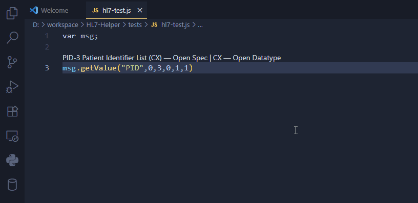

# HL7 Hover & IntelliSense

A VS Code extension that adds **hover info**, **code lenses**, **diagnostics**, and **autocomplete** for HL7 v2 messages in Rhapsody/HAPI JavaScript code.

## Features

- **Hover tooltips**  
Hover over a segment, field, or component index to get the definition of that component. Shows segment/field/component names and datatypes.



- **IntelliSense Suggestions**
Auto complete suggestions as you type.


- Autocomplete
  - Segments (PID, PV1, …)
  - Fields (with labels and datatypes)
  - Components (with labels)
  - Suggestions pop when typing and when moving the cursor into a slot.
  - Numeric items are sorted correctly (1, 2, 3, … not 1, 10, 11).
  - Selecting an item replaces the token you’re on.

- **Replace field suggestions**
Placing the cursor into a field that already contains a value will trigger IntelliSense and selection will replace the existing value.


- **CodeLens shortcuts**
Links above calls to open official HL7 segment/datatype documentation.


- **Diagnostics**
Invalid field/component numbers are squiggled with a warning.


## Usage

In JavaScript/TypeScript files that use Rhapsody/HAPI-style calls:

```js
msg.getValue("PID", 0, 3, 0, 1, 1)
```

- Place the cursor on "PID" → autocomplete segments.
- Place the cursor on 3 → autocomplete PID fields.
- Place the cursor on 1 (component) → autocomplete CX components.

Supports both:

- `msg.getValue(...)` (member form)
- `hl7.getValue(msg, ...)` (wrapper form)
- Multi-line calls.

## Settings

Extension contributes these settings:

- hl7Helper.fnNames: Functions to match (default: ["getValue","setValue","getValues","setValues"])
- hl7Helper.version: HL7 version (v231, v240, v251, v27)
- hl7Helper.specBaseUrl: Base URL for documentation links (default: Caristix HL7 spec)

## Development

- Compile: npm run compile
- Watch mode: npm run watch
- Debug: F5 in VS Code → Extension Development Host

Package:

```bash
npx vsce package
```

## Known quirks

- Path-style calls (`"/PID(0)-3(0)-1(1)"`) have hover support, completions are basic.
- Field/component completions always show the full list (even if a digit is present) by design.

## The Future

- Setting: hl7Helper.debug (boolean) to enable logs.
- Command: “HL7: Reload Dictionaries” (re-reads JSON without reload).
- Unit tests for parsing (getEffIndexAtPosition, partial-arg reader).
- Path-style completions ("/PID(0)-3(0)-1(1)") like you did for index style.
- Go to definition-ish command that navigates to the spec of the hovered item directly (segment/field/component).
- Caching: memorize parsed JSON for perf on huge workspaces.